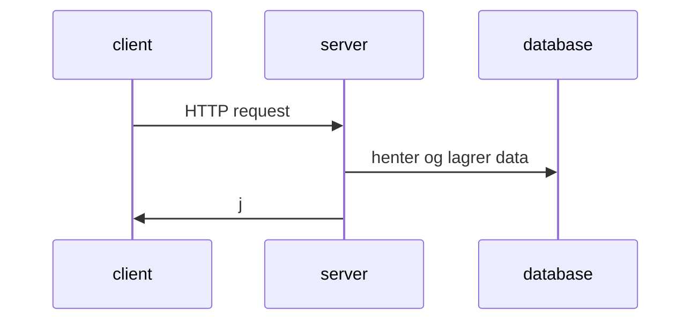

# Gruppe 22 - Markdown

| Studentnummer | Navn                                   | Epost           |
| ------------- | -------------------------------------- | --------------- |
| #####         | Vilde Andreas Fjeld Pedersen           | vilped@hiof.no  |
| #####         | Anne May Omberg                        | annemni@hiof.no |
| 223810        | Thor Andreas Holberg Murtnes-Hatlestad | thoraho@hiof.no |

## Innholdsfortegnelse

1. [API endepunkt](#api-endpoints)
2. [Diagram](#diagram)
3. [URLer](#urler)

## API endepunkter

Skal dokumentere hvilke api-endepunkter (ressurser) som skal brukes

## Respons

Skal til hvert api-endepunkt dokumentere hvilke verb som er tilgjengelig.
Hva slags forespørsler skal de håndtere.

## Diagram

Skal til hvert api-endepunkt dokumentere responsen og statuskoden for de
ulike verbene. Hva slags data skal returneres når det går riktig / feil.

### URLer

Skal dokumentere hvilke sider (urler) som skal benytte de ulike APIene og
grovt hva som kan gjøres på den enkelte siden. Hvilke sider i "app" skal
opprettes og grovt hva som kan gjøres på de ulike sidene.
