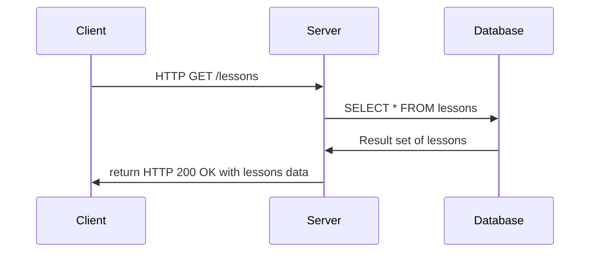

# Oppgave 1 - Gruppe 22

| Studentnummer | Navn                                   | Epost           |
| ------------- | -------------------------------------- | --------------- |
| #####         | Vilde Andreas Fjeld Pedersen           | vilped@hiof.no  |
| #####         | Anne May Omberg                        | annemni@hiof.no |
| 223810        | Thor Andreas Holberg Murtnes-Hatlestad | thoraho@hiof.no |

## Innholdsfortegnelse

1. [API endepunkt](#api-endepunkt)
2. [HTTP verb](#http-verb)
3. [Diagram](#diagram)
4. [URLer](#urler)

## API endepunkt

Skal dokumentere hvilke api-endepunkter (ressurser) som skal brukes

```javascript
/courses
/lessons
/comments
```

## HTTP verb

Skal til hvert api-endepunkt dokumentere hvilke verb som er tilgjengelig.
Hva slags forespørsler skal de håndtere.

#### /courses

```javascript
'api/courses' {
    GET: Henter liste over alle kurs
    POST: Legger til nytt kurs
}

'api/courses/{id}' {
    GET: Henter et spesifikt kurs
    DELETE: Sletter et spesifikt kurs
    PUT: Oppdaterer kategori til et spesifikt kurs
}
```

#### /lessons

```javascript
GET 'api/lessons' //Henter liste over alle leksjoner

POST 'api/lessons' //Oppretter ny leksjon

PUT = 'api/lessons' / { id } //Oppdaterer én spesifikk leksjon

DELETE = 'api/lessons' / { id } //Sletter en spesifikk leksjon
```

## Diagram

Skal til hvert api-endepunkt dokumentere responsen og statuskoden for de
ulike verbene. Hva slags data skal returneres når det går riktig / feil.

#### Success



### URLer

Skal dokumentere hvilke sider (urler) som skal benytte de ulike APIene og
grovt hva som kan gjøres på den enkelte siden. Hvilke sider i "app" skal
opprettes og grovt hva som kan gjøres på de ulike sidene.
